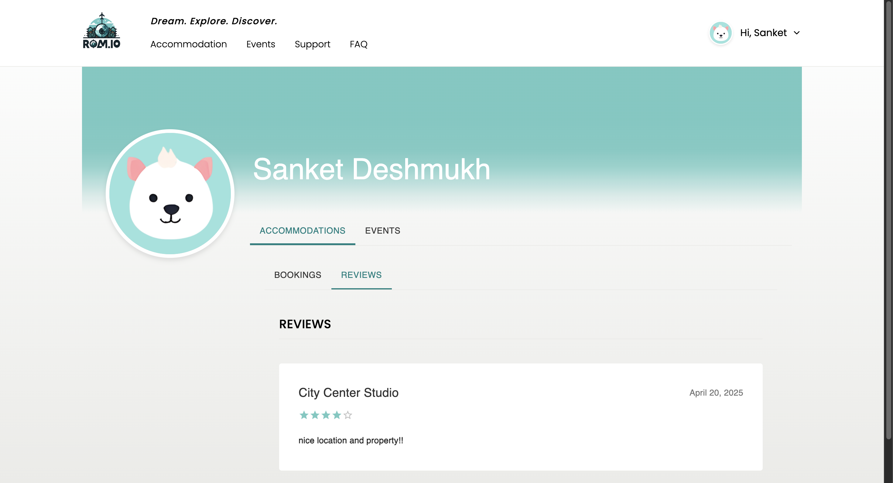

# Roam.io

**Roam.io** is a comprehensive travel tourism website that simplifies trip planning and booking. The platform integrates tools for trip organization, accommodation booking, local event discovery, and real-time navigation. Users can explore destinations, share reviews, upload photos, and rate their experiences—all within one seamless platform.

---

## ✨ Key Features

1. **Event Planning**  
   Plan personalized itineraries by selecting destinations and preferred activities.

2. **Accommodation Bookings**  
   Search and book hotels, vacation rentals, and other types of stays.

3. **Local Events & Activities**  
   Discover and explore events and attractions available in your chosen destination.

4. **User Reviews & Ratings**  
   Share feedback and help other travelers by rating accommodations and attractions.

5. **Real-time Navigation**  
   Integrated map support to guide users to nearby places and planned events.

6. **Active Support System**  
   User feedback is logged into Google Sheets, enabling the admin team to respond with offers or assistance.

---

## 🛠 Tech Stack

- **Frontend**: React.js  
- **Backend**: Go  
- **Database**: PostgreSQL  
- **Database Visualization**: DBeaver (optional)

---

## 🚀 Application Setup

### 1. Clone the Repository

```bash
git clone https://github.com/yourusername/roam.io.git
```

### 2. Frontend Setup
``` bash
cd roam.io/web/roam
npm install            # Install all required packages
npm run dev            # Start the React development server
```

### (Optional) Run Cypress Component Tests
``` bash
npx cypress open       # Launch Cypress test runner
```

### 3. Database Setup
Create a PostgreSQL user:

**Username:** postgres. 
**Password:** postgres. 
**Database name:** mydb. 

Tables will be auto-created when the backend server is started.

### 4. Backend Setup
``` bash
cd roam.io/back_end
go mod tidy            # Install Go dependencies
go run .               # Start the Go backend server
```

📌 **Note**: For tables like accommodation and events, data must be inserted manually using the Postman collection available in the back_end/ folder.

---

### 🖼️ UI Screenshots

#### 🏠 Login/Registration Page

> Users can create an account for themselves and login using the same as shown below.


---

#### 🏨 Accommodation Listings

> Users can browse and filter hotels, rentals, and other stays. Each listing includes reviews, ratings, and photos.


---

#### 📅 Event Explorer

> Find local events by location and date, with detailed descriptions and ticket options.


---

#### ✍️ Review & Ratings

> Users can post reviews and rate places they've visited.


---

#### 🗺️ Maps & Navigation

> Integrated maps help users explore nearby attractions, hotels, and restaurants.


#### User Profile

> User can see their previous/upcming bookings for accommodations/events under theri profile





### 👨‍💻 Team Members


| Name                    | UF ID     |
|-------------------------|-----------|
| Palaque Sharma          | 83907444  |
| Pragyna Abhishek Titty  | 64192812  |
| Sanket Deshmukh         | 32226339  |
| Shaurya Singh           | 69871462  |

Feel free to contribute, open issues, or suggest improvements!
